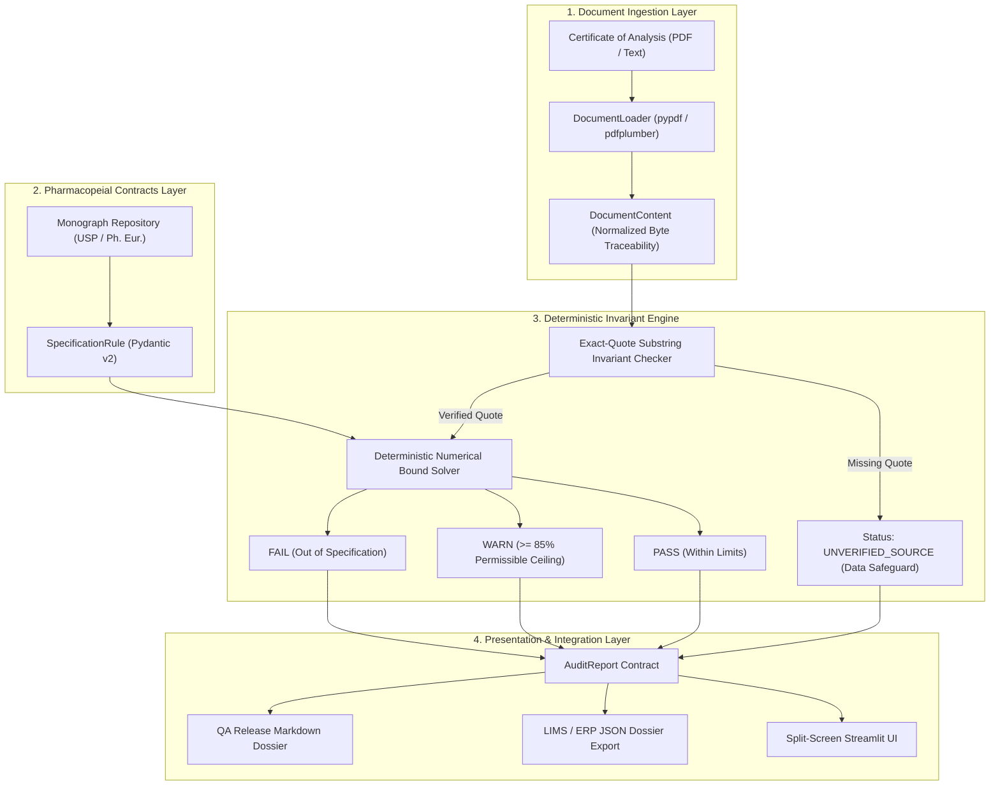

# ⚖️ ReguTech-AI Auditor

[](https://github.com/by-matt/regutech-ai-auditor/actions)


> **Deterministic Zero-Hallucination Regulatory Compliance Engine for Certificates of Analysis (CoA) & Monograph Standards.**  
> *Engineered by Byron Calderón González • Applied AI Engineer & Biotech Systems Architect.*

---

## 🔬 Executive Overview & The Problem

In biopharmaceutical manufacturing and industrial bioprocesses governed by **Good Manufacturing Practice (GMP)**, **ISO 17025**, and **FDA 21 CFR Part 11**, quality control (QC) and quality assurance (QA) teams spend hundreds of engineering hours cross-referencing supplier **Certificates of Analysis (CoAs)** against internal specifications and official pharmacopeias (**USP**, **Ph. Eur.**).

Standard LLM/RAG pipelines suffer from **probabilistic stochasticity**:
1. **Numerical Hallucination:** A model may misread $\le 0.25\text{ EU/mL}$ as $\le 2.5\text{ EU/mL}$, passing a contaminated batch.
2. **Citation Drift:** Generative models often paraphrase or invent analytical references not verbatim present in the source documentation.
3. **Regulatory Non-Compliance:** Unauditable decisions violate the ALCOA+ data integrity principles (*Attributable, Legible, Contemporaneous, Original, Accurate*).

**ReguTech-AI Auditor** eliminates these hazards through a **deterministic closed-loop architecture**:
* **Exact-Quote Substring Invariant:** Every piece of analytical evidence extracted from the document is validated against the raw file bytes. If the evidence quote is not an exact textual substring, the finding is immediately quarantined as `UNVERIFIED_SOURCE`.
* **Deterministic Bound Engine:** All threshold comparisons ($\le, \ge, \in [\text{Min}, \text{Max}]$) are evaluated with formal arithmetic logic, outputting exact percentage deviations.
* **Preventative Trend Early-Warning:** Flags parameters operating within $\ge 85\%$ of regulatory ceilings before batch failure occurs.

---

## 🏛️ System Architecture



---

## 📐 Mathematical Formulation

### 1. The Exact-Quote Substring Invariant
Let $\mathcal{D} = \{c_1, c_2, \dots, c_N\}$ be the normalized sequence of characters in the ingested CoA document, and let $\mathcal{Q} = \{q_1, q_2, \dots, q_M\}$ be the extracted evidence citation.

The verification predicate $\mathcal{V}(\mathcal{Q}, \mathcal{D})$ is defined as:
$$\mathcal{V}(\mathcal{Q}, \mathcal{D}) = \begin{cases} 1 & \text{if } \exists k \in [1, N - M + 1] \text{ such that } c_{k+j-1} = q_j \quad \forall j \in [1, M] \\ 0 & \text{otherwise} \end{cases}$$

$$\text{If } \mathcal{V}(\mathcal{Q}, \mathcal{D}) = 0 \implies \text{Status} \leftarrow \text{UNVERIFIED\_SOURCE}$$

### 2. Relative Deviation Metric
For an upper-bound specification $x \le L_{\max}$ and measured value $x$:
$$\Delta_{\text{dev}}(x) = \begin{cases} 0 & \text{if } x \le L_{\max} \\ \frac{x - L_{\max}}{L_{\max}} \times 100\% & \text{if } x > L_{\max} \end{cases}$$

### 3. Preventative Warning Guardrail
Given an operational warning ratio $\alpha \in [0.70, 0.95]$ (default $\alpha = 0.85$):
$$\text{Status} \leftarrow \begin{cases} \text{FAIL} & \text{if } x > L_{\max} \\ \text{WARN} & \text{if } \alpha \cdot L_{\max} \le x \le L_{\max} \\ \text{PASS} & \text{if } x < \alpha \cdot L_{\max} \end{cases}$$

---

## ⚡ Quickstart & Installation

### Prerequisites
- Python 3.11+
- [uv](https://github.com/astral-sh/uv) (recommended) or pip

### Local Setup with `uv`
```bash
# Clone the repository
git clone https://github.com/by-matt/regutech-ai-auditor.git
cd regutech-ai-auditor

# Create virtual environment and install dependencies
uv venv
uv pip install -e ".[dev]"

# Run test suite
uv run pytest -v tests/

# Launch Streamlit Audit Dashboard
uv run streamlit run src/ui/app.py
```

---

## 🧪 Benchmark Test Matrix

| Test Scenario | Batch ID | Focus Attributes | Expected Outcome | Compliance Score |
| :--- | :--- | :--- | :---: | :---: |
| **Conforming Lot** | `INS-2026-X88` | High Purity Recombinant Insulin | **APPROVED** | **100.0%** |
| **Critical Failure** | `INS-2026-FAIL04` | Endotoxins (14.8 vs $\le 10$), Pb (16.5 vs $\le 10$) | **REJECTED** | **56.2%** |
| **Adversarial Injection** | `INS-2026-ADV01` | Fabricated LLM Quote Injection | **FLAGGED / UNVERIFIED** | **Quarantined** |

---

## 👨‍💻 Author & Engineering Profile

**Byron Calderón González**  
*Biotechnology Engineer (UNAB Top 25%) • Applied AI / ML Specialist • Google PM (240h)*  
- 💼 [LinkedIn Profile](https://linkedin.com/in/byron-calderón)
- 🐙 [GitHub Profile (@by-matt)](https://github.com/by-matt)
- 📧 Contact: [byroncalde@gmail.com](mailto:byroncalde@gmail.com)
